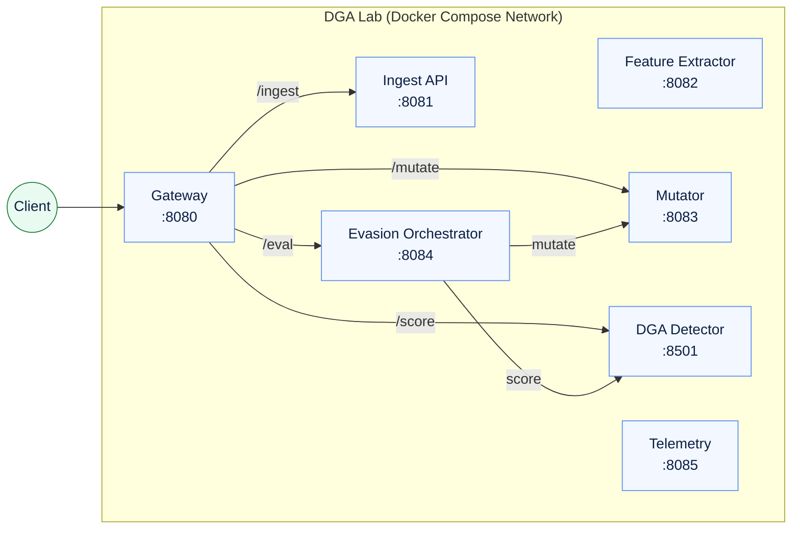

# DGA Lab — Microservices for Botnet DGA Detection Evasion

Hands‑on microservice lab to **evaluate and harden ML‑based DGA (Domain Generation Algorithm) detectors** with simple, reproducible adversarial mutations. Built with **Python/FastAPI** and packaged for **Docker Compose** (Helm chart optional).  
> **Defensive research only.** Use on systems you own/administer.

---

## 🧭 Overview
- **Gateway (8080)**: single entrypoint (`/ingest`, `/score`, `/mutate`, `/eval`)
- **Ingest API (8081)**: load test domains
- **Feature Extractor (8082)**: simple lexical/entropy features (extensible)
- **Mutator (8083)**: generate adversarial domain variants
- **Evasion Orchestrator (8084)**: iterate mutate→score until evasion
- **DGA Detector (8501)**: scoring API (swap in your model server later)
- **Telemetry (8085)**: stub for metrics/logs

---

## 🗺️ Architecture (Mermaid)
> Rendered automatically on GitHub.



---

## 🚀 Quick start (Docker Compose)

```powershell
# from the repo root
docker compose up -d --build
docker ps --format "table {.Names}\t{.Ports}"
```

**One‑shot tests (PowerShell):**
```powershell
# Direct (bypasses gateway) — recommended for first run
Unblock-File .\run-dga-direct.ps1
.\run-dga-direct.ps1

# Via gateway (after internal URLs are set to service names)
Unblock-File .\run-dga-end2end.ps1
.\run-dga-end2end.ps1
```

**Manual curls (via gateway):**
```powershell
# Ingest
Invoke-RestMethod http://localhost:8080/ingest -Method POST -ContentType 'application/json' `
  -Body (@{ batch_id="demo"; domains=@("secure-bank.co","paypa1-login.net","xkcd.com") } | ConvertTo-Json -Compress)

# Score
Invoke-RestMethod http://localhost:8080/score -Method POST -ContentType 'application/json' `
  -Body (@{ domain="paypa1-login.net" } | ConvertTo-Json -Compress)

# Mutate
Invoke-RestMethod http://localhost:8080/mutate -Method POST -ContentType 'application/json' `
  -Body (@{ domain="paypa1-login.net"; ops=@("insert:pos=3:ch=x") } | ConvertTo-Json -Compress)

# Evasion
Invoke-RestMethod http://localhost:8080/eval -Method POST -ContentType 'application/json' `
  -Body (@{ domain="paypa1-login.net"; max_iters=5; target_conf=0.25 } | ConvertTo-Json -Compress)
```

---

## ⚙️ Configuration (Docker)

Inside Docker, **use service names**, not `localhost`:

```yaml
# docker-compose.yml (excerpt)
services:
  gateway:
    environment:
      INGEST_URL: http://ingest:8081/ingest/domains
      SCORE_URL:  http://detector:8501/score
      MUTATE_URL: http://mutator:8083/mutate
      EVAL_URL:   http://orchestrator:8084/eval

  orchestrator:
    environment:
      MUTATE_URL: http://mutator:8083/mutate
      SCORE_URL:  http://detector:8501/score
```

Observability:
- **/metrics** on each service (if enabled)
- Optional **OpenTelemetry** via `OTEL_*` envs (`OTLP` exporter supported)

---

## 🧪 Local dev without Docker
```powershell
py -3 -m venv .venv
.\.venv\Scripts\Activate.ps1
pip install -r requirements.txt

# in separate terminals
uvicorn dga-detector.app:app --port 8501
uvicorn ingest-api.app:app --port 8081
uvicorn feature-extractor.app:app --port 8082
uvicorn mutator.app:app --port 8083
uvicorn evasion-orchestrator.app:app --port 8084
uvicorn gateway.app:app --port 8080
uvicorn telemetry.app:app --port 8085
```

---

## 📚 References (APA style)

Le, H., Pham, Q., Sahoo, D., & Hoi, S. C. H. (2018). *URLNet: Learning a URL representation with deep learning for malicious URL detection*. **arXiv**. https://arxiv.org/abs/1802.03162

Yu, B., Pan, J., Hu, J., Nascimento, A. C., & De Cock, M. (2018). *Character level based detection of DGA domain names*. In **2018 International Joint Conference on Neural Networks (IJCNN)** (pp. 1–8). IEEE. http://faculty.washington.edu/mdecock/papers/byu2018a.pdf

---

## 📝 How to cite this repository

If you use this project in your work, please cite it.

### BibTeX
```bibtex
@software{jackson_dga-lab_2025,
  author       = {Freeman Jackson},
  title        = {DGA Lab: Microservices for Botnet DGA Detection Evasion},
  year         = {2025},
  version      = {v0.1.0},
  publisher    = {GitHub},
  url          = {https://github.com/4th/dga-lab},
  note         = {Computer software}
}
```

### APA
Jackson, F. (2025). *DGA Lab: Microservices for Botnet DGA Detection Evasion* (Version v0.1.0) [Computer software]. https://github.com/4th/dga-lab

> 💡 If you create a tagged release (e.g., `v0.1.0`) or archive via Zenodo to obtain a DOI, update the version and add the DOI to your citation.

---

## 🛡️ License & use
Recommended: **Apache-2.0** (permissive + patent grant).  
Add `SPDX-License-Identifier: Apache-2.0` to new source files.  
This is for **defensive security evaluation** and education only.

---

## 🙌 Credits
Built and maintained by **Freeman Jackson**.
